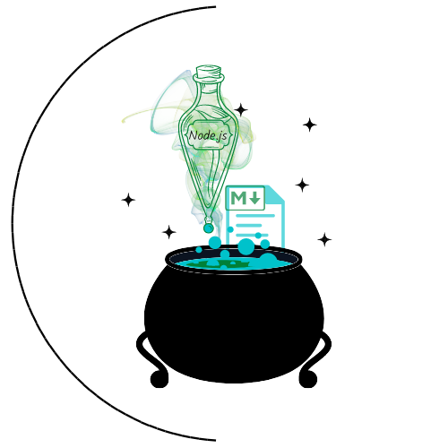

<h1 align="center"> README Lab </h1>

<p align="center">
    
  <br>
  <i>README generator
    <br> built using Node.js.</i>
  <br>
</p>
<br>


---
## Description

README Lab is a back-end application that generates a professional README.md file for your GitHub project. Writing one from scratch can be frustrating and confusing, so use this tool to generate the perfect document!

I've noticed how much time we developers spend creating a quality README.md file, or when we don't have the time to do this well, then it's often overlooked or treated as an afterthought. That's why I created this package, which will save us time and allow us to spend more time on the project itself. It will also ensure that every app has a professional README.md — something we all need!

During this process, I learned how crucial the file is to the application and what other items could be added to make it easier for users to understand and use effectively. Even the most elegantly designed application is useless if no one knows how to use it.

## Table of Contents
- [Description](#description)
- [Table of Contents](#table-of-contents)
- [Installation](#installation)
  - [Cloning the Repository](#cloning-the-repository)
  - [Prerequisites](#prerequisites)
  - [Setting Up](#setting-up)
- [Mock-Up](#mock-up)
- [Usage](#usage)
- [Guide](#guide)
- [Questions](#questions)
- [Contributions](#contributions)
  - [Contributing Guidelines](#contributing-guidelines)
  - [Code of Conduct](#code-of-conduct)
- [Credits](#credits)
  - [Acknowledgements](#acknowledgements)
  - [Links](#links)
- [License](#license)

## Installation

### Cloning the Repository

Click `<> code` - the green button. After clicking, in the local tab, copy the SSH key. Open the terminal in your Macbook or [git bash](https://git-scm.com/downloads), if you have Windows/Linux, and type:

```bash
git clone [paste ssh key]
```

I would recommend downloading [Visual Studio Code](https://code.visualstudio.com/download) to edit the code locally. If you need more information on how to clone a repository, [click here](https://docs.github.com/en/repositories/creating-and-managing-repositories/cloning-a-repository)!
### Prerequisites

This package requires you to have [Node.js](https://nodejs.org/en/download/), npm and Inquirer installed on your machine. You can install `npm` by running the code below on your terminal:

```bash
curl -o- https://raw.githubusercontent.com/nvm-sh/nvm/v0.39.3/install.sh | bash
```
### Setting Up

Open the project in VS Code and make sure you are in the directory of this application before installing `Inquirer`. To install it, type the command below on your terminal:

```bash
npm install --save inquirer@^8.0.0
```

**Note: Be sure to download this version, because newer versions no longer use the commonjs syntax require('inquirer').**

## Mock-Up

The following gif shows the web application's appearance and functionality:


## Usage

Launch the application by entering the command below on your terminal:

```bash
node index.js
```

Once the application is launched, a series of questions will appear so that the user can enter the necessary information to build the file. 

A new README file will then be generated and saved in a different folder called `gen`. The content will vary depending on the user's inputs, but the available items are: **Title of the project, Description, Table of Contents, Installation, Usage, License, Contributing, Tests, and Questions**.

If you need more guidance on how to use README Lab, click here for the tutorial!

**Note: the README will be generated with some hints that you will need to change according to your project. After you finish, erase the notes.**

## Guide

You can find a template README.md inside the `utils` folder where you will find all the items and reasons why you should add them to your file.

## Questions

For questions and support feel free to contact me via:

<a href="mailto:larigens@gmail.com">📧 Email </a> 
<a href="https://github.com/larigens">🐈‍⬛ GitHub </a>

## Contributions
### Contributing Guidelines

Want to report a bug, contribute some code, request a new feature, or improve the documentation? You can submit an issue and I will gladly welcome you as a contributor, but before submitting an issue, please search the issue tracker, as it may already exist!

### Code of Conduct

Our Code of Conduct follows the same principles as the [Contributor Covenant](https://www.contributor-covenant.org/version/2/1/code_of_conduct/), version 2.1.

## Credits
### Acknowledgements

- [W3 Schools](https://www.w3schools.com)

- [MDN](https://developer.mozilla.org/en-US/)

- [Node.js](https://nodejs.org/en/)
  
- [NPM](https://www.npmjs.com/)
  
- [Inquirer](https://www.npmjs.com/package/inquirer)
  
- [Professional README Guide](https://coding-boot-camp.github.io/full-stack/github/professional-readme-guide)
  
- [Shields](https://shields.io/)
  
- [PaksTech](https://pakstech.com/blog/inquirer-js/)
  
- [FreeCodeCamp](https://www.freecodecamp.org/news/how-to-write-a-good-readme-file/)

### Links

[](https://larigens.github.io/lari-gui/)
[](https://www.linkedin.com/in/lari-gui/)
[](https://twitter.com/coffeebr_eak)

## License

Please refer to the [LICENSE](https://choosealicense.com/licenses/mit/) in the repo.
